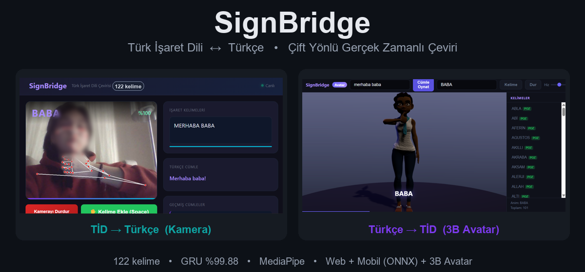
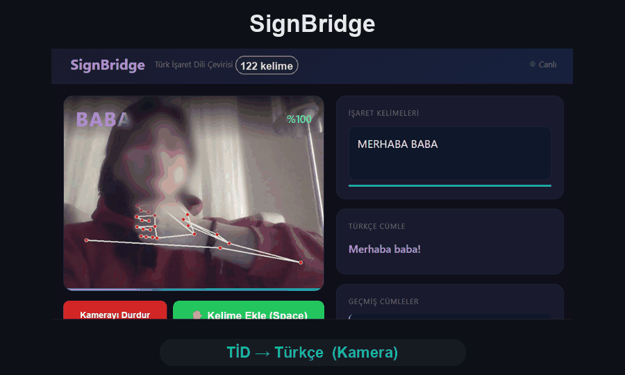
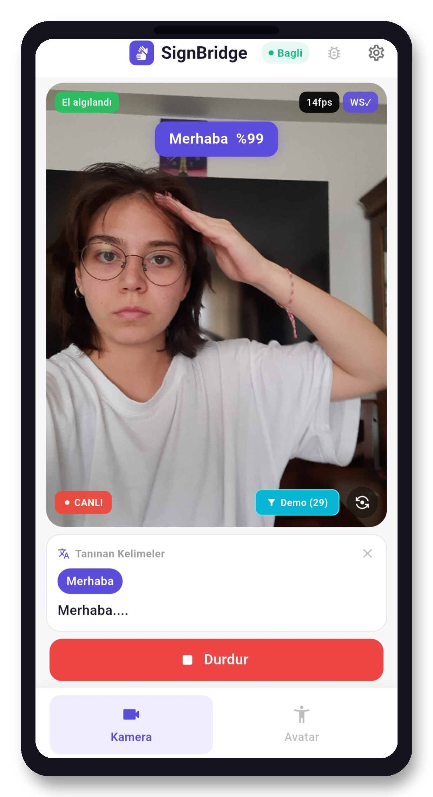
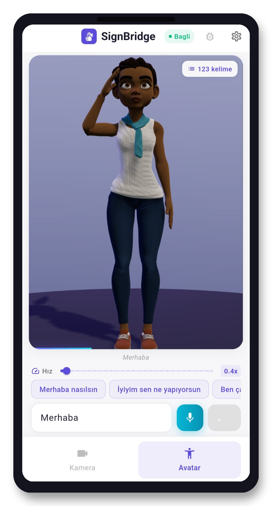
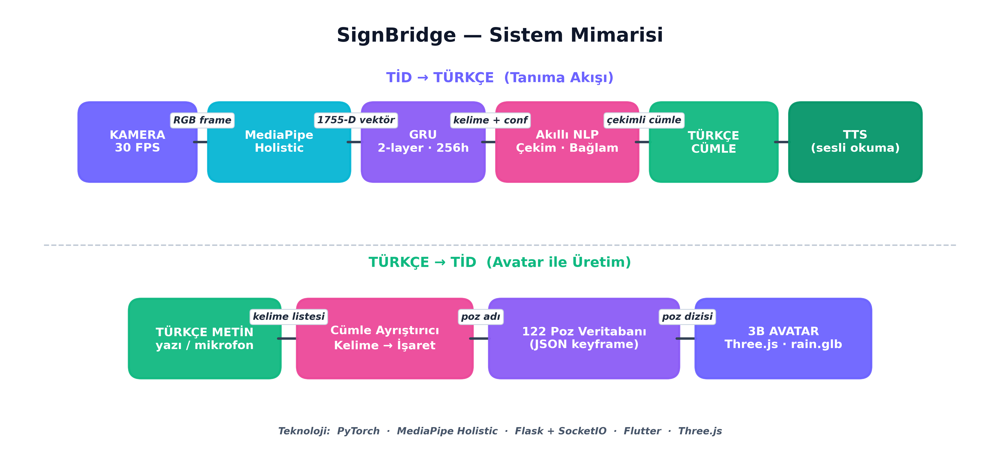
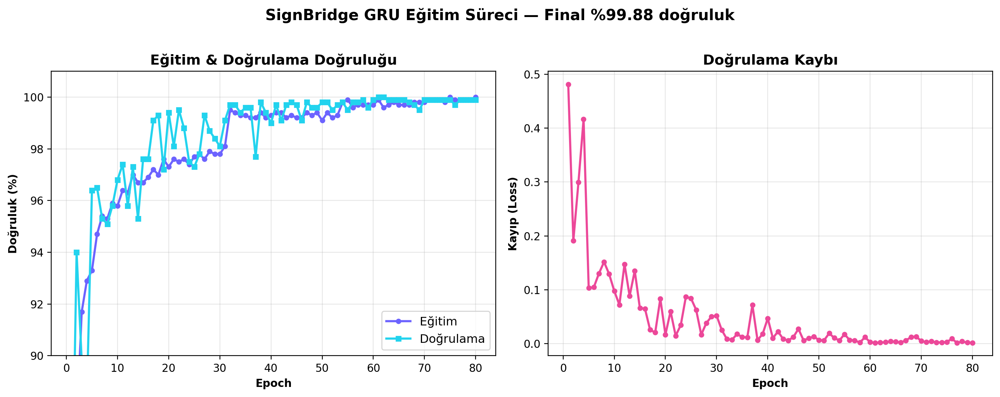
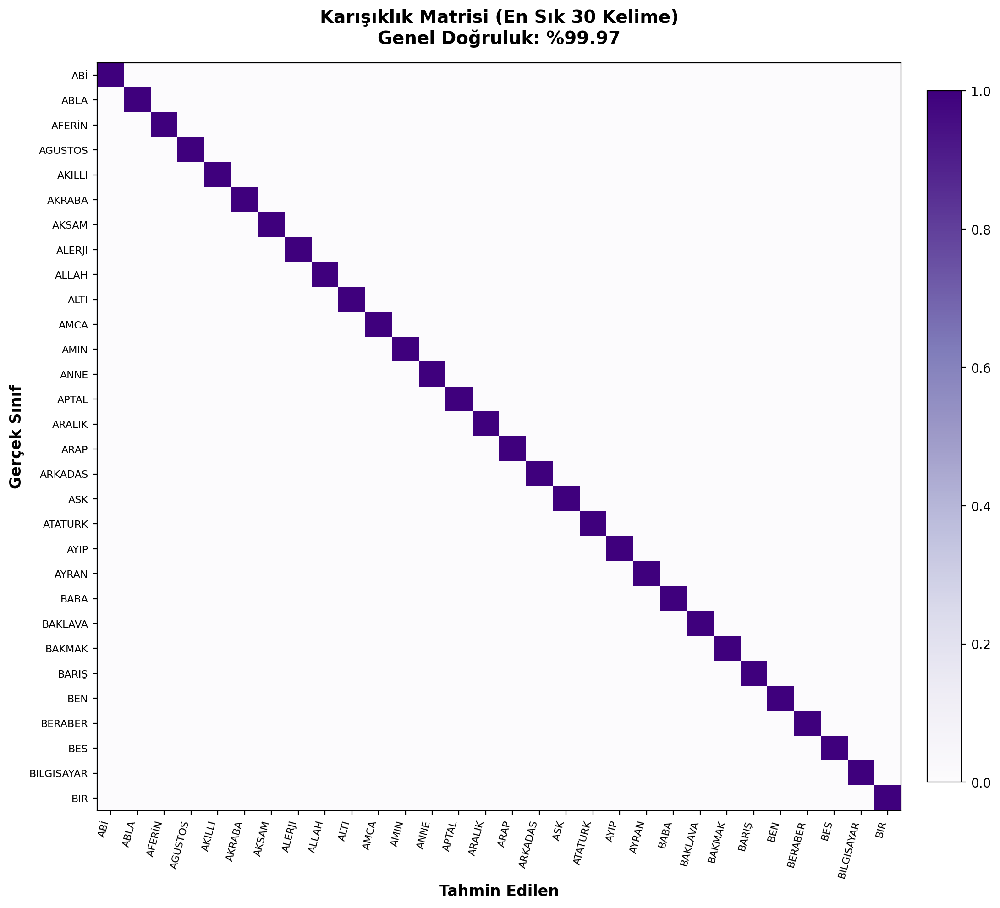

<div align="center">

# 🤟 SignBridge

### Türk İşaret Dili ↔ Türkçe • Çift Yönlü Gerçek Zamanlı Çeviri Sistemi

İşitme engelli bireyler ile işiten bireyler arasındaki iletişim köprüsü.
Kameraya yapılan işareti **Türkçe metne ve sese** çevirir; yazılan/söylenen Türkçeyi de **3 boyutlu avatar** ile işaret diline çevirir.


<br/>



</div>

---

## 📌 Genel Bakış

**SignBridge**, sınırlı ancak günlük yaşamda sık kullanılan **122 kelimelik** bir Türk İşaret Dili (TİD) sözlüğü üzerinde **çift yönlü** ve **gerçek zamanlı** çalışan bir çeviri sistemidir:

- **TİD → Türkçe:** Kamera önünde yapılan işaret, yapay zekâ modeliyle tanınır → akıcı Türkçe cümleye dönüştürülür → sesli okunur.
- **Türkçe → TİD:** Yazılan veya mikrofona söylenen Türkçe ifade, 3 boyutlu bir avatar tarafından işaret diliyle gösterilir.

Sistem hem **web** (Python/Flask) hem de **Android mobil uygulaması** (Flutter) olarak çalışır. Mobil uygulama, ONNX sayesinde **internet bağlantısı olmadan tamamen cihaz üzerinde** tahmin yapabilir.

### 🎬 Demo

<div align="center">



<br/><br/>

**📱 Mobil Uygulama**

| Kamera (TİD→Türkçe) | Avatar (Türkçe→TİD) |
|:---:|:---:|
|  |  |

</div>

---

## ✨ Özellikler

- 🔄 **Çift yönlü çeviri** — TİD→Türkçe ve Türkçe→TİD aynı sistemde
- 🗣️ **122 kelimelik sözlük** — aile, sayılar, günler, aylar, selamlaşma, fiiller, yiyecekler, meslekler ve daha fazlası
- ⚡ **Gerçek zamanlı** — kameradan canlı tanıma, ~1 saniyelik işaret penceresi
- 📱 **Cihaz üzerinde mobil** — ONNX ile internetsiz, tamamen çevrimdışı çalışma
- 🧠 **Akıllı NLP** — tanınan ham kelimeleri (gloss) dilbilgisi kurallarıyla akıcı Türkçe cümleye çevirir
- 🧍 **3B Avatar** — Three.js tabanlı, 123 kayıtlı işaret pozu ile Türkçe→işaret
- 🔊 **Sesli giriş/çıkış** — TTS (metinden sese) ve STT (sesten metne)
- 🔒 **Gizlilik** — ham görüntü/video saklanmaz; yalnızca anahtar nokta koordinatları işlenir
- 🎯 **Demo modu** — gösterimlerde kararlılık için kelime beyaz listesi

---

## 🏗️ Sistem Mimarisi

<div align="center">
  
</div>

**TİD → Türkçe akışı:**
`Kamera (30 FPS)` → `MediaPipe Holistic (543 anahtar nokta)` → `Öznitelik + 2 aşamalı normalleştirme` → `GRU modeli` → `Tahmin yumuşatma` → `Kural tabanlı NLP` → `Türkçe cümle + TTS`

**Türkçe → TİD akışı:**
`Metin / Mikrofon (STT)` → `Kelime köklerine ayırma` → `Poz sözlüğü (saved_poses.json)` → `3B Avatar (Three.js)`

---

## 🧠 Model ve Başarım

| Ölçüt | Değer |
|---|---|
| Model | 2 katmanlı **GRU**, 256 gizli birim |
| Sınıf (kelime) sayısı | **122** |
| Giriş | 30 kare × 1755 öznitelik (dizi) |
| Kare başına öznitelik | 1755 (543×3 koordinat + 126 hız) |
| Doğrulama doğruluğu | **%99,88** |
| Test doğruluğu | **%99,97** (3.660 örnek) |
| Eniyileyici / Kayıp | Adam / Cross-Entropy |

<div align="center">

| Eğitim & Doğrulama Eğrileri | Karışıklık Matrisi |
|:---:|:---:|
|  |  |

</div>

---

## 📊 Veri Seti

- **14.974** ham örnek dizisi toplandı (kelime başına ~150, kameranın önünde tekrarlı kayıt)
- **6 farklı veri artırma** tekniğiyle **105.182** örneğe çıkarıldı (gürültü, ölçekleme, öteleme, döndürme, zaman bükme, aynalama)
- Her örnek = bir kelimenin **30 karelik** (~1 sn) kaydı
- **İki aşamalı normalleştirme:** omuz merkezli (uzaklıktan bağımsız) + bilek merkezli (parmak duruşu öne çıkar)
- **Gizlilik:** Fotoğraf/video saklanmaz; sadece MediaPipe anahtar nokta koordinatları (.npy) tutulur

---

## 🛠️ Kullanılan Teknolojiler

| Bileşen | Teknoloji |
|---|---|
| Anahtar nokta çıkarımı | MediaPipe Holistic (543 nokta) |
| Görüntü işleme | OpenCV |
| Model eğitimi | PyTorch (GRU) |
| Mobil çıkarım | ONNX Runtime |
| Web sunucu | Python, Flask, Socket.IO, Werkzeug |
| Mobil uygulama | Flutter / Dart (Android) |
| 3B Avatar | Three.js (rain.glb, 123 poz) |
| Ses | Web Speech API, flutter_tts, speech_to_text |

---

## 📱 Mobil Uygulama

Android uygulaması ayrı bir repoda geliştirilmektedir:
👉 **[esmasila/SignBridge-Mobile](https://github.com/esmasila/SignBridge-Mobile)**

- Flutter/Dart ile yazıldı
- MediaPipe + ONNX modeli **doğrudan cihazda** çalışır (internet gerekmez)
- Web ile aynı 122 kelime, aynı NLP mantığı ve aynı eşik değerleri
- Sürüm (release) APK olarak paketlenebilir

---

## 🚀 Kurulum & Çalıştırma (Web)

```bash
# 1) Depoyu klonla
git clone https://github.com/esmasila/SignBridge.git
cd SignBridge

# 2) Sanal ortam
python -m venv venv
# Windows:
venv\Scripts\activate
# Linux/macOS:
source venv/bin/activate

# 3) Bağımlılıklar
pip install -r requirements.txt

# 4) Web uygulamasını başlat
python experiment_v2/web_app.py
```

Tarayıcıdan `http://localhost:5000` adresini aç:
- **Kamera** sekmesi → işaret yap, Türkçe metni ve sesi al
- **Avatar** sekmesi → Türkçe yaz/konuş, işaret dili gösterimini izle

---

## 📁 Proje Yapısı (özet)

```
SignBridge/
├── experiment_v2/
│   ├── web_app.py              # Flask + Socket.IO web uygulaması
│   ├── checkpoints/            # Eğitilmiş GRU modeli + label_map.json (122 kelime)
│   └── poster_artifacts/       # Mimari, eğitim grafiği, karışıklık matrisi
├── blender/                    # 3B avatar varlıkları
├── docs/screenshots/           # README görselleri
└── README.md
```

---

## 🗺️ Yol Haritası

- [ ] Sözlüğü çok kişiden toplanan veriyle genişletmek
- [ ] Gerçek işitme engelli bireylerle saha testleri
- [ ] Sürekli (cümle düzeyinde) işaret tanıma
- [ ] iOS desteği
- [ ] Avatar hareketlerini daha doğal hale getirme

---

## 👩‍💻 Yazar & Danışman

- **Geliştirici:** Esma Sıla ŞAHİNCİ
- **Danışman:** Öğr. Gör. Dr. Kadir HALTAŞ
- Nevşehir Hacı Bektaş Veli Üniversitesi — Bilgisayar Mühendisliği Bölümü, Bitirme Ödevi (2026)

---

## 📄 Lisans

Bu proje [MIT Lisansı](LICENSE) altında lisanslanmıştır.

<div align="center">

*SignBridge — iletişimi herkes için erişilebilir kılmak.* 🤟

</div>
